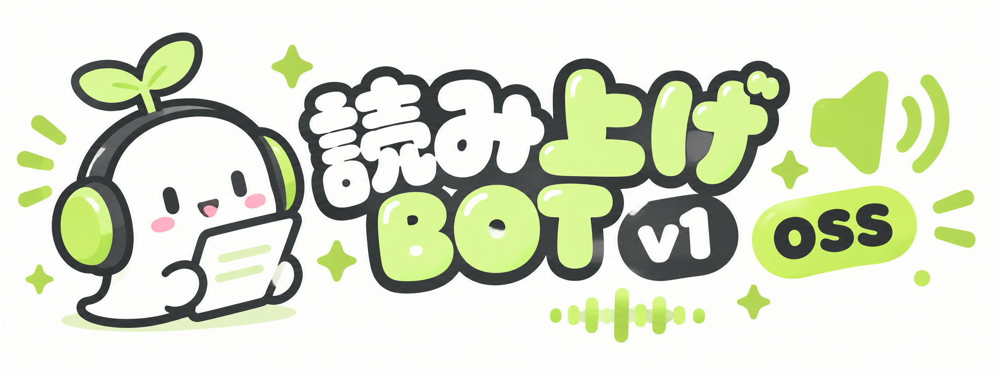
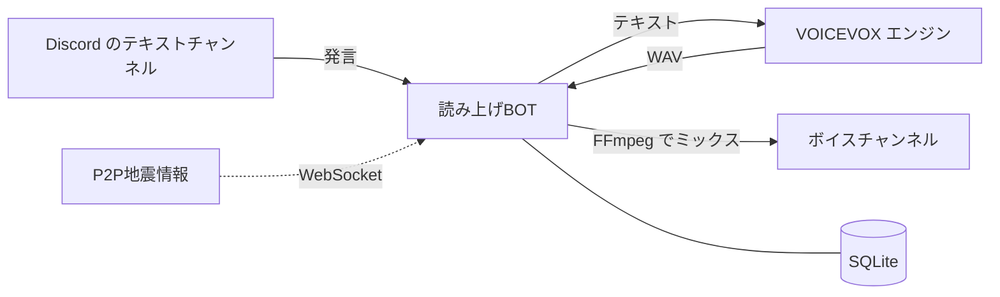

<p align="center">
  
</p>

<p align="center">
  VOICEVOX で Discord の発言を読み上げる、セルフホスト用の読み上げ BOT
</p>

<p align="center">
  <a href="https://www.python.org/"></a>
  <a href="https://github.com/Rapptz/discord.py"></a>
  <a href="https://voicevox.hiroshiba.jp/"></a>
  <a href="https://www.sqlite.org/"></a>
  <a href="https://ffmpeg.org/"></a>
</p>

<p align="center">
  <a href="#docker"></a>
  <a href="#windows"></a>
  <a href="#ubuntu"></a>
  <a href="LICENSE"></a>
  
</p>

<p align="center">
  <a href="#クイックスタート">クイックスタート</a> ·
  <a href="#コマンド">コマンド</a> ·
  <a href="#設定">設定</a> ·
  <a href="#トラブルシューティング">トラブルシューティング</a>
</p>

---

テキストチャンネルに書かれた発言を、VOICEVOX の声でボイスチャンネルに読み上げます。
自分のサーバー用にそのまま立てられるよう、Python や ffmpeg、VOICEVOX エンジンの準備まで起動スクリプトがやります。
必要なのは Discord の BOT トークンだけです。

## 特徴

| | |
| --- | --- |
| **声をユーザーごとに設定** | キャラクター・スタイル・速度・音高・抑揚・音量を `/voice` の画面から選べます。試聴もできます |
| **読み上げ辞書** | 読み間違える単語をサーバーごとに登録できます |
| **自動接続・自動退出** | VC に人が入ったら接続、誰もいなくなったら退出。入退室の読み上げもあります |
| **長文でも待たせない** | 文の切れ目で分けて合成し、できたところから順に読み上げます |
| **音声ファイル再生** | BGM や効果音を流せます。読み上げ中は自動で音量が下がります |
| **地震速報** | P2P地震情報から受信し、チャンネルへの投稿と VC での読み上げを行います |
| **簡単に起動** | Docker / Windows / Ubuntu それぞれに起動スクリプトがあります |

## 技術スタック

<p>
  
</p>



## クイックスタート

### 1. Discord で BOT を作る

1. [Discord Developer Portal](https://discord.com/developers/applications) で **New Application** を押してアプリを作る
2. 左メニューの **Bot** で **Reset Token** を押し、表示されたトークンを控える
3. 同じ画面の **Privileged Gateway Intents** で次の 2 つを ON にする
   - SERVER MEMBERS INTENT
   - MESSAGE CONTENT INTENT

### 2. 起動する

好きな方法を 1 つ選んでください。初回起動時にトークンを聞かれるので、貼り付ければ `.env` に保存されます。

<a id="docker"></a>

####  Docker（おすすめ）

Docker（Windows / Mac は [Docker Desktop](https://www.docker.com/products/docker-desktop/)）があれば、VOICEVOX エンジンもまとめて起動します。常駐もこれが一番楽です。

```sh
./docker-start.sh        # Linux / Mac
docker-start.bat         # Windows（ダブルクリックでも可）
```

<details>
<summary>スクリプトを使わない場合</summary>

```sh
cp .env.example .env     # DISCORD_TOKEN を書き込む
docker compose up -d
docker compose logs -f bot
```

</details>

<a id="windows"></a>

####  Windows

`start.bat` をダブルクリックするだけです。

- Python 3.10 以上が無ければ winget でインストールします
- ffmpeg が無ければ自動でインストールします
- [VOICEVOX](https://voicevox.hiroshiba.jp/) がインストールされていれば、そのエンジンを裏で起動します
- VOICEVOX が無く Docker Desktop がある場合は、Docker で VOICEVOX エンジンを起動します

<a id="ubuntu"></a>

####  Ubuntu

```sh
./start.sh
```

- python3-venv・ffmpeg・libopus0 が足りなければ `sudo apt-get install` で入れます
- VOICEVOX エンジンが `127.0.0.1:50021` で動いていなければ Docker で起動します

<details>
<summary>systemd で常駐させる</summary>

`/etc/systemd/system/yomiage-bot.service` を作ります（パスとユーザー名は環境に合わせてください）。
一度 `./start.sh` を手動で実行し、トークンの保存と依存のインストールを済ませておいてください。

```ini
[Unit]
Description=読み上げBOT v1 OSS
After=network-online.target docker.service

[Service]
User=ubuntu
WorkingDirectory=/home/ubuntu/yomiage-bot-v1-oss
ExecStart=/home/ubuntu/yomiage-bot-v1-oss/.venv/bin/python launcher.py
Restart=on-failure

[Install]
WantedBy=multi-user.target
```

```sh
sudo systemctl enable --now yomiage-bot
```

</details>

### 3. サーバーに招待する

起動するとログに招待 URL が出るので、それを開いてサーバーに追加します。

```
[INFO] tts.main: 招待URL: https://discord.com/oauth2/authorize?client_id=...
```

VC に入ってから、読み上げてほしいチャンネルで `/join` を実行すれば完了です。

> [!NOTE]
> スラッシュコマンドが Discord に反映されるまで、初回は数分かかることがあります。

## コマンド

<details open>
<summary><b>基本</b></summary>

| コマンド | 内容 |
| --- | --- |
| `/join` | VC に接続し、実行したチャンネルを読み上げる |
| `/leave` | 切断する |
| `/skip` または `s` と発言 | 読み上げ中のメッセージを飛ばす |
| `/stopqueue` または `sall` と発言 | 読み上げ待ちをすべて消す |
| `/read_here` | 読み上げるチャンネルをここに変える |
| `/voice` | 自分の声を設定する（全サーバー共通） |
| `/help` | 使い方を表示する |

</details>

<details>
<summary><b>読み上げ辞書</b></summary>

| コマンド | 内容 |
| --- | --- |
| `/dictionary add` | 単語の読み方を登録する |
| `/dictionary remove` | 登録した単語を消す |
| `/dictionary list` | 登録済みの単語を見る |

</details>

<details>
<summary><b>音声ファイル再生</b></summary>

| コマンド | 内容 |
| --- | --- |
| `/sound play` | 添付した音声ファイルを再生する（ループ・音量を指定可） |
| `/sound stop` | 再生を止める |
| `/sound volume` | 再生中の音量を変える |
| `/sound status` | 再生状況を見る |

</details>

<details>
<summary><b>地震速報</b></summary>

| コマンド | 内容 |
| --- | --- |
| `/earthquake enable` | 地震速報の ON / OFF（既定は OFF） |
| `/earthquake channel` | 速報を投稿するチャンネル |
| `/earthquake min_scale` | 通知する最小震度 |
| `/earthquake eew` | 緊急地震速報も通知するか |
| `/earthquake speak` | VC で読み上げるか |
| `/earthquake test` | サンプルの速報で動作を確認する |
| `/earthquake show` | 今の設定を見る |

</details>

<details>
<summary><b>サーバー設定</b></summary>

| コマンド | 内容 |
| --- | --- |
| `/settings show` | 今の設定を見る |
| `/settings read_name` | 発言者の名前を読むか |
| `/settings max_length` | 1 メッセージで読む最大文字数 |
| `/settings join_leave_notify` | 入退室を読み上げるか |
| `/settings auto_join` | VC に人が入ったら自動で接続するか |
| `/settings auto_leave` | 誰もいなくなったら自動で抜けるか |

</details>

辞書・地震速報・サーバー設定の変更には「サーバー管理」権限が必要です。

## 設定

`.env` で変更できます。必須なのは `DISCORD_TOKEN` だけで、他は空でも動きます。全項目は [`.env.example`](.env.example) にあります。

| 項目 | 既定値 | 内容 |
| --- | --- | --- |
| `DISCORD_TOKEN` | なし | BOT のトークン |
| `VOICEVOX_URL` | `http://127.0.0.1:50021` | VOICEVOX エンジンの URL |
| `DEFAULT_SPEAKER_ID` | `3` | 新しく使い始めた人の声（3 = ずんだもん ノーマル） |
| `MAX_MESSAGE_LENGTH` | `200` | 最大読み上げ文字数の初期値 |
| `TTS_CHUNK_LENGTH` | `60` | 長文を分けて合成するときの 1 回の文字数 |
| `SUPPORT_URL` | なし | 接続時の案内に出す「サポート」ボタンの URL |
| `DEV_GUILD_ID` | なし | スラッシュコマンドをすぐ反映させたいサーバーの ID |
| `QUAKE_ENABLED` | `true` | 地震速報の受信を BOT 全体で止めるときは `false` |

データは `data/bot.db`（Docker 版は `bot-data` ボリューム）に保存されます。

<details>
<summary>GPU 版の VOICEVOX エンジンを使う（Docker）</summary>

`docker-compose.yml` の `voicevox` を次のように書き換えます。NVIDIA GPU と NVIDIA Container Toolkit が必要です。

```yaml
  voicevox:
    image: voicevox/voicevox_engine:nvidia-latest
    deploy:
      resources:
        reservations:
          devices:
            - driver: nvidia
              count: 1
              capabilities: [gpu]
```

</details>

## 更新

```sh
git pull
docker compose up -d --build   # Docker 版
./start.sh                     # Ubuntu（Windows は start.bat）。依存が変わっていれば自動で入れ直します
```

## トラブルシューティング

<details>
<summary>「ログインに失敗しました」と出る</summary>

トークンが間違っています。Developer Portal でトークンを発行し直し、`.env` の `DISCORD_TOKEN` を書き換えてください。

</details>

<details>
<summary>「MESSAGE CONTENT INTENT ...を有効にしてください」と出る</summary>

Developer Portal の Bot 画面で、SERVER MEMBERS INTENT と MESSAGE CONTENT INTENT を ON にしてください。

</details>

<details>
<summary>接続はするが何も読み上げない</summary>

- ログに「VOICEVOXエンジンに接続できません」と出ていないか確認してください
- ブラウザで http://127.0.0.1:50021/docs が開ければエンジンは動いています
- 読み上げ対象のチャンネルが合っているか `/settings show` で確認してください

</details>

<details>
<summary>スラッシュコマンドが出てこない</summary>

初回は反映まで数分かかることがあります。すぐ試したい場合は `.env` の `DEV_GUILD_ID` にサーバー ID を入れて再起動すると、そのサーバーには即座に反映されます。

</details>

<details>
<summary>Ubuntu で音が出ない</summary>

`libopus0` が入っているか確認してください（`start.sh` を使えば自動で入ります）。

```sh
sudo apt-get install -y libopus0 ffmpeg
```

</details>

## ディレクトリ構成

```
.
├── main.py              BOT 本体
├── launcher.py          トークン入力と VOICEVOX の自動起動
├── config.py            .env の読み込み
├── cogs/                スラッシュコマンドとイベント処理
├── core/                音声合成・ミキサー・DB など
├── tools/               警報音の生成、地震速報の確認
├── start.bat / start.sh               Windows / Ubuntu 用の起動スクリプト
├── docker-start.bat / docker-start.sh Docker 用の起動スクリプト
└── docker-compose.yml
```

## クレジット

- 音声合成: [VOICEVOX](https://voicevox.hiroshiba.jp/)
- 地震情報: [P2P地震情報](https://www.p2pquake.net/)
- Discord ライブラリ: [discord.py](https://github.com/Rapptz/discord.py)

> [!IMPORTANT]
> 読み上げ音声は VOICEVOX で生成しています。VOICEVOX 本体と各キャラクターの[利用規約](https://voicevox.hiroshiba.jp/term/)に従って使ってください。
> 音声を配信・公開する場合は「VOICEVOX:ずんだもん」のようなクレジット表記が必要です。

## ライセンス

[MIT License](LICENSE)
